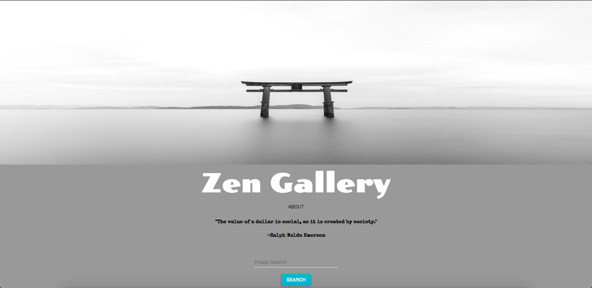

# Zen Gallery 

Link to app [here](https://zengallery-48a6b.firebaseapp.com/)

## Author

### [Hayley Zulkoski](https://github.com/hayz999)
##### https://www.linkedin.com/in/hayley-zulkoski-webdev/

## Installation

Run `npm install` to install dependencies.

## Serving

Run `npm start` to serve locally.

## About

This application was my first time using React to create an interactive web page of my own.  The requirements for this project where to pull from two different API end points.  I wanted to create a simple and clean user interface that combined thought provoking quotes and whatever images the user searched for. I used the Pexels stockphoto API and a random quote generator API.

## Technologies used

- React
- React Material UI
- CSS
- Firebase 

